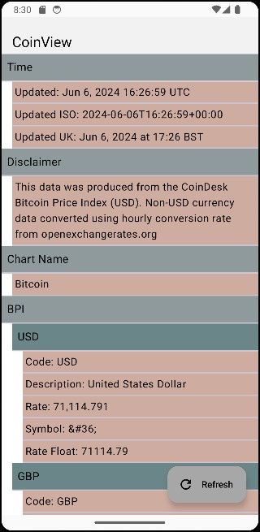

## Preview:

## Test Task:

**Objective:** Create a Kotlin application that retrieves data from the CoinDesk API to fetch the current Bitcoin price and displays this data in a user-friendly manner.

**API for Use:** [CoinDesk API](https://api.coindesk.com/v1/bpi/currentprice.json)

### Main Requirements and Steps:

1. **Project Setup:**
   - Initialize a new project in Android Studio with Kotlin support.
   - Add necessary dependencies for networking (e.g., Retrofit, OkHttp) and JSON parsing (e.g., Gson).

2. **Data Models:**
   - Create data classes to parse the response from the API. Ensure that the models match the data structure provided by the API.

3. **API Request:**
   - Configure a Retrofit client to make requests to the API.
   - Create an interface with a method to fetch the current Bitcoin price.

4. **UI Development:**
   - Create the main screen of the application using ConstraintLayout.
   - Place Views on the screen to display time, disclaimer, chartName, and bpi.
   - When clicking on each of these objects, display detailed data for the nested JSON elements. Show additional Views (expand) nested within bpi to display new Views for USD, GBP, EUR.

5. **Handling Clicks:**
   - Implement logic to handle clicks on UI elements. When clicking on USD, GBP, EUR, display corresponding information (code, symbol, rate, description, rate_float).

6. **Updating UI:**
   - After retrieving data from the API, update the user interface with the relevant data.

### Additional Requirements:

- **Clean and Well-Structured Code:** Ensure that the code is clean and well-structured.
- **Proper Network Error Handling:** The application should handle possible network errors correctly and display clear error messages to the user.

## Building the Project

1. Clone the project via Android Studio:
- Launch Android Studio.
- Choose "File" -> "New" -> "Project from Version Control" in top menu bar.
- Enter repository URL (https://github.com/Ontheheavens/CoinView-Test.git) and press "Clone".

3. Build the project:
- Click on the "Build" menu.
- Choose "Make Project" to compile the project.

## Running the App

1. Connect a device or start an emulator:
- Ensure that a physical device is connected to your computer, or start an Android emulator from Android Studio.

2. Run the app from Android Studio:
- Click on the green "Play" button in the toolbar.
- Select the device or emulator you want to run the app on.
- Click "OK" to install and run the app.
